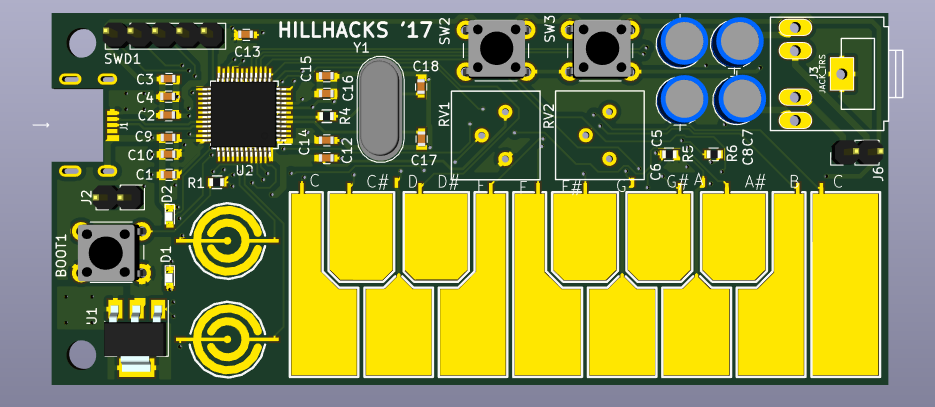

PCB Badge for hillhacks 2017
============================

Based around stm32f072 (48 pin) and used capacitive touch footprints from https://github.com/maltman23/ArduTouch/

TODO
----

* add battery connector

* verify crystal loading caps acc. to crystal, rc lpf passives values

* firmware

